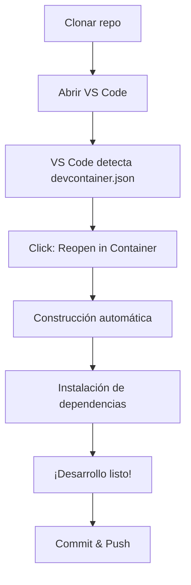
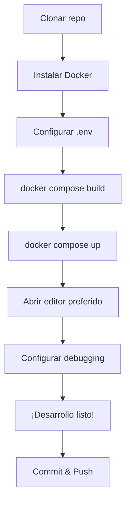

# 🤔 Dev Containers vs Docker Compose: ¿Cuándo usar cada uno?

Esta guía te ayudará a decidir cuándo usar **Dev Containers** y cuándo usar **Docker Compose** puro para tu flujo de desarrollo.

---

## 🎯 Resumen ejecutivo

| Aspecto | Dev Containers | Docker Compose |
|---------|----------------|----------------|
| **Mejor para** | Desarrollo individual/equipo pequeño | Equipos grandes, CI/CD, producción |
| **VS Code** | Integración nativa completa | Solo como cliente externo |
| **Configuración** | Automática al abrir proyecto | Manual, más flexible |
| **Performance** | Excelente en desarrollo | Mejor para producción |
| **Curva de aprendizaje** | Muy fácil | Intermedia |
| **Colaboración** | Ideal para onboarding rápido | Mejor para workflows complejos |

---

## 🚀 Dev Containers: ¿Cuándo elegirlos?

### ✅ Casos ideales para Dev Containers

#### 👥 **Equipos pequeños y desarrollo individual**
```
✓ Equipo de 1-5 desarrolladores
✓ Proyecto personal o startup
✓ Prototipado rápido
✓ Onboarding de nuevos miembros frecuente
```

#### 🎯 **Enfoque en productividad inmediata**
- **Setup en 30 segundos**: Abrir proyecto → VS Code detecta → "Reopen in Container" → ¡Listo!
- **Entorno consistente**: Todos los miembros del equipo tienen exactamente las mismas herramientas
- **Configuración cero**: Extensiones, settings y herramientas se instalan automáticamente

#### 💻 **Desarrollo principalmente en VS Code**
```json
{
  "extensions": [
    "ms-vscode.vscode-eslint",      // Se instala automáticamente
    "esbenp.prettier-vscode",       // Configuración unificada
    "ms-vscode.vscode-typescript"   // Sin configurar manualmente
  ]
}
```

#### 🎓 **Educación y workshops**
- **Workshops de programación**: Los estudiantes pueden empezar a programar inmediatamente
- **Bootcamps**: Sin perder tiempo configurando entornos
- **Demos técnicas**: Funciona igual en cualquier máquina

### 📈 **Ventajas específicas de Dev Containers**

#### 1. **Experiencia de desarrollo nativa**
```typescript
// IntelliSense funciona perfectamente
// Debugging integrado
// Terminal integrado con hot reload
// Git integrado con historial visual
```

#### 2. **Gestión automática de dependencias**
```bash
# Se ejecuta automáticamente al crear el contenedor
"postCreateCommand": "cd frontend && pnpm install && cd ../backend && pnpm install"
```

#### 3. **Puertos automáticos**
- Los puertos se forward automáticamente
- Notificaciones cuando servicios están listos
- Browser se abre automáticamente en el frontend

#### 4. **Debugging avanzado**
```json
// launch.json se configura automáticamente
{
  "type": "node",
  "request": "attach",
  "name": "Attach to Backend",
  "port": 9229
}
```

---

## 🐳 Docker Compose: ¿Cuándo elegirlo?

### ✅ Casos ideales para Docker Compose

#### 🏢 **Proyectos empresariales y equipos grandes**
```
✓ Equipos de 5+ desarrolladores
✓ Arquitectura de microservicios
✓ Múltiples entornos (dev, staging, prod)
✓ Integración con CI/CD pipelines
```

#### 🔧 **Flexibilidad máxima de configuración**
```yaml
# Configuraciones específicas por entorno
services:
  backend:
    build:
      context: ./backend
      target: ${BUILD_TARGET:-development}  # production, testing, etc.
    environment:
      - NODE_ENV=${NODE_ENV:-development}
```

#### 🌐 **Múltiples servicios y bases de datos**
```yaml
services:
  frontend:          # React
  backend:           # Node.js API
  auth-service:      # Servicio de autenticación
  payment-service:   # Servicio de pagos
  mongo:            # Base de datos principal
  postgres:         # Base de datos analítica  
  redis:            # Cache
  elasticsearch:    # Búsqueda
  nginx:            # Load balancer
```

#### 🎛️ **Control granular del entorno**
```yaml
# Perfiles para diferentes escenarios
profiles:
  - development
  - testing  
  - staging
  
# Escalado horizontal
deploy:
  replicas: 3
```

### 📈 **Ventajas específicas de Docker Compose**

#### 1. **Compatibilidad universal**
```bash
# Funciona en cualquier editor
code .              # VS Code
vim backend/src/    # Vim
idea .              # IntelliJ
```

#### 2. **Optimización para producción**
```yaml
# Multi-stage builds
FROM node:20-alpine AS builder
WORKDIR /app
COPY package*.json ./
RUN npm ci --only=production

FROM node:20-alpine AS runner
COPY --from=builder /app/node_modules ./node_modules
```

#### 3. **Integración CI/CD natural**
```yaml
# .github/workflows/deploy.yml
- name: Deploy to staging
  run: |
    docker compose -f docker-compose.staging.yml up -d
    docker compose -f docker-compose.staging.yml exec backend npm run migrate
```

#### 4. **Monitoreo y logs centralizados**
```yaml
services:
  backend:
    logging:
      driver: "json-file"
      options:
        max-size: "10m"
        max-file: "3"
```

---

## 🔄 Flujos de trabajo típicos

### 🎯 Flujo con Dev Containers



**Tiempo total**: 2-5 minutos

### 🐳 Flujo con Docker Compose



**Tiempo total**: 5-15 minutos (primera vez)

---

## 📊 Comparación detallada

### 🚀 Performance

| Aspecto | Dev Containers | Docker Compose |
|---------|----------------|----------------|
| **Startup time** | ⭐⭐⭐ Rápido (1-2 min) | ⭐⭐⭐⭐ Muy rápido (30s) |
| **Hot reload** | ⭐⭐⭐⭐⭐ Excelente | ⭐⭐⭐⭐ Muy bueno |
| **File watching** | ⭐⭐⭐⭐ Muy bueno | ⭐⭐⭐⭐⭐ Excelente |
| **Resource usage** | ⭐⭐⭐ Medio | ⭐⭐⭐⭐ Eficiente |

### 🛠️ Experiencia de desarrollo

| Aspecto | Dev Containers | Docker Compose |
|---------|----------------|----------------|
| **IntelliSense** | ⭐⭐⭐⭐⭐ Perfecto | ⭐⭐⭐ Depende del editor |
| **Debugging** | ⭐⭐⭐⭐⭐ Integrado | ⭐⭐⭐ Configuración manual |
| **Git integration** | ⭐⭐⭐⭐⭐ Nativo | ⭐⭐⭐⭐ Bueno |
| **Terminal** | ⭐⭐⭐⭐ Integrado | ⭐⭐⭐⭐⭐ Flexible |

### 🔧 Configuración y mantenimiento

| Aspecto | Dev Containers | Docker Compose |
|---------|----------------|----------------|
| **Setup inicial** | ⭐⭐⭐⭐⭐ Automático | ⭐⭐⭐ Manual |
| **Customización** | ⭐⭐⭐ Limitada | ⭐⭐⭐⭐⭐ Completa |
| **Troubleshooting** | ⭐⭐ Más difícil | ⭐⭐⭐⭐ Transparente |
| **Documentation** | ⭐⭐⭐ En crecimiento | ⭐⭐⭐⭐⭐ Madura |

---

## 🎯 Casos de uso específicos

### 🎓 **Educación y onboarding**
```
✅ Dev Containers
- Nuevo miembro del equipo puede empezar en 5 minutos
- Sin instalaciones locales complicadas
- Entorno idéntico para todos
```

### 🏢 **Empresa con múltiples proyectos**
```
✅ Docker Compose
- Flexibility para diferentes tech stacks
- Integración con Kubernetes existente
- Control granular de recursos
```

### 🚀 **Startup con prototipado rápido**
```
✅ Dev Containers  
- Velocidad de iteración máxima
- Foco en producto, no en infraestructura
- Onboarding de freelancers inmediato
```

### 🔬 **Desarrollo de librerías/SDKs**
```
✅ Docker Compose
- Testing en múltiples versiones de Node/Python
- Matrix builds automáticos
- Publicación automatizada
```

---

## 🔄 ¿Se pueden combinar?

¡**Sí**! Muchos proyectos usan ambos:

### Estrategia híbrida
```
📁 proyecto/
├── .devcontainer/          # Para desarrollo diario
│   └── devcontainer.json
├── docker-compose.yml      # Desarrollo completo + CI/CD
├── docker-compose.dev.yml  # Solo servicios básicos
└── docker-compose.prod.yml # Producción
```

### Comandos según contexto
```bash
# Desarrollo individual (VS Code)
# → Usar Dev Container

# Testing completo
docker compose -f docker-compose.yml up

# CI/CD pipeline
docker compose -f docker-compose.prod.yml up -d
```

---

## 🤝 Recomendaciones por escenario

### 🥇 **Elige Dev Containers si...**

- ✅ Tu equipo usa principalmente **VS Code**
- ✅ Quieres **onboarding instantáneo** de nuevos desarrolladores
- ✅ El proyecto es **relativamente simple** (< 5 servicios)
- ✅ Priorizas **velocidad de desarrollo** sobre flexibilidad
- ✅ Trabajas en **prototipos** o **MVPs**
- ✅ Enseñas programación o haces **workshops**

### 🥇 **Elige Docker Compose si...**

- ✅ Tu equipo usa **editores mixtos** (VS Code, IntelliJ, Vim, etc.)
- ✅ Trabajas con **arquitectura de microservicios**
- ✅ Necesitas **múltiples entornos** (dev, staging, prod)
- ✅ Planeas deployar con **Kubernetes** o **Docker Swarm**
- ✅ Requieres **configuraciones específicas** por desarrollador
- ✅ El proyecto tiene **múltiples bases de datos** y servicios

---

## 🎯 Migración entre enfoques

### De Dev Containers a Docker Compose
```bash
# 1. Extraer configuración de devcontainer.json
# 2. Crear docker-compose.yml equivalente  
# 3. Migrar postCreateCommand a scripts
# 4. Configurar editores individualmente
```

### De Docker Compose a Dev Containers
```bash
# 1. Crear .devcontainer/devcontainer.json
# 2. Configurar dockerComposeFile
# 3. Definir servicio principal
# 4. Migrar scripts de inicio
```

---

## ✅ Checklist de decisión

**¿Cuántos desarrolladores?**
- 1-3: Considera Dev Containers
- 4+: Probablemente Docker Compose

**¿Qué editor usan?**
- 90%+ VS Code: Dev Containers
- Mixto: Docker Compose

**¿Complejidad del proyecto?**
- 1-3 servicios: Dev Containers está bien
- 4+ servicios: Docker Compose más apropiado

**¿Experiencia del equipo?**
- Junior/Mixta: Dev Containers (más fácil)
- Senior: Docker Compose (más control)

**¿Entorno de producción?**
- Kubernetes/Cloud: Docker Compose (mejor preparación)
- Simple/Serverless: Cualquiera funciona

---

**💡 Recuerda**: No hay elección "incorrecta", ambas opciones funcionan excelentemente. La clave es elegir la que mejor se adapte a tu equipo y proyecto actual. ¡Y siempre puedes cambiar después!** 🚀